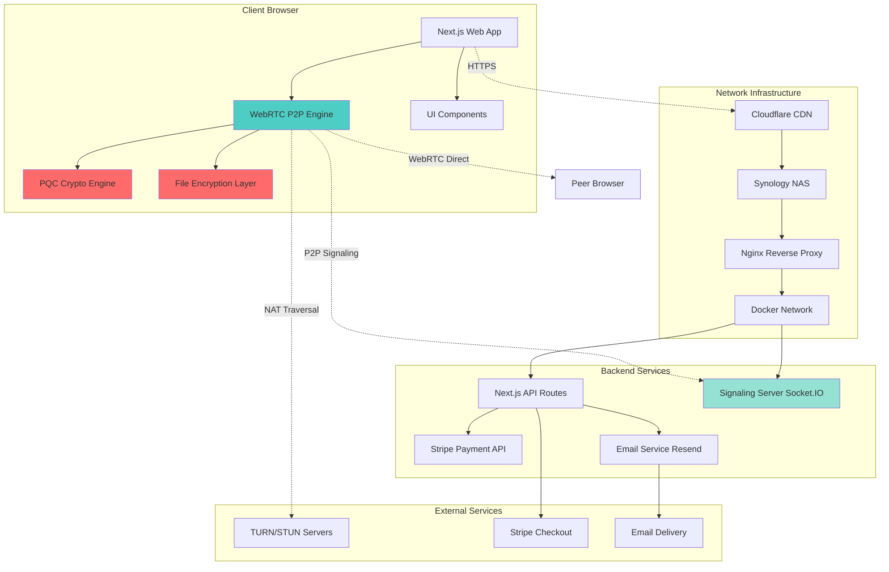
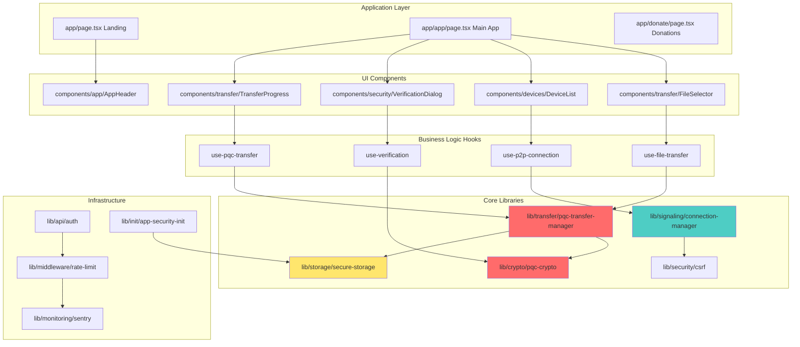
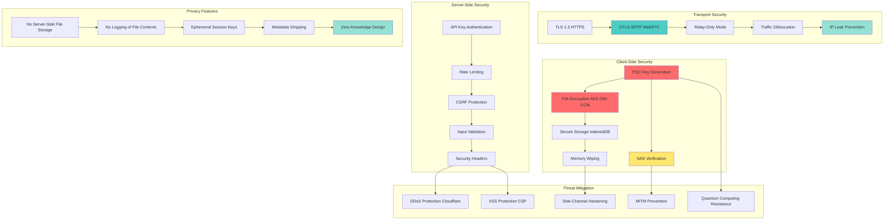
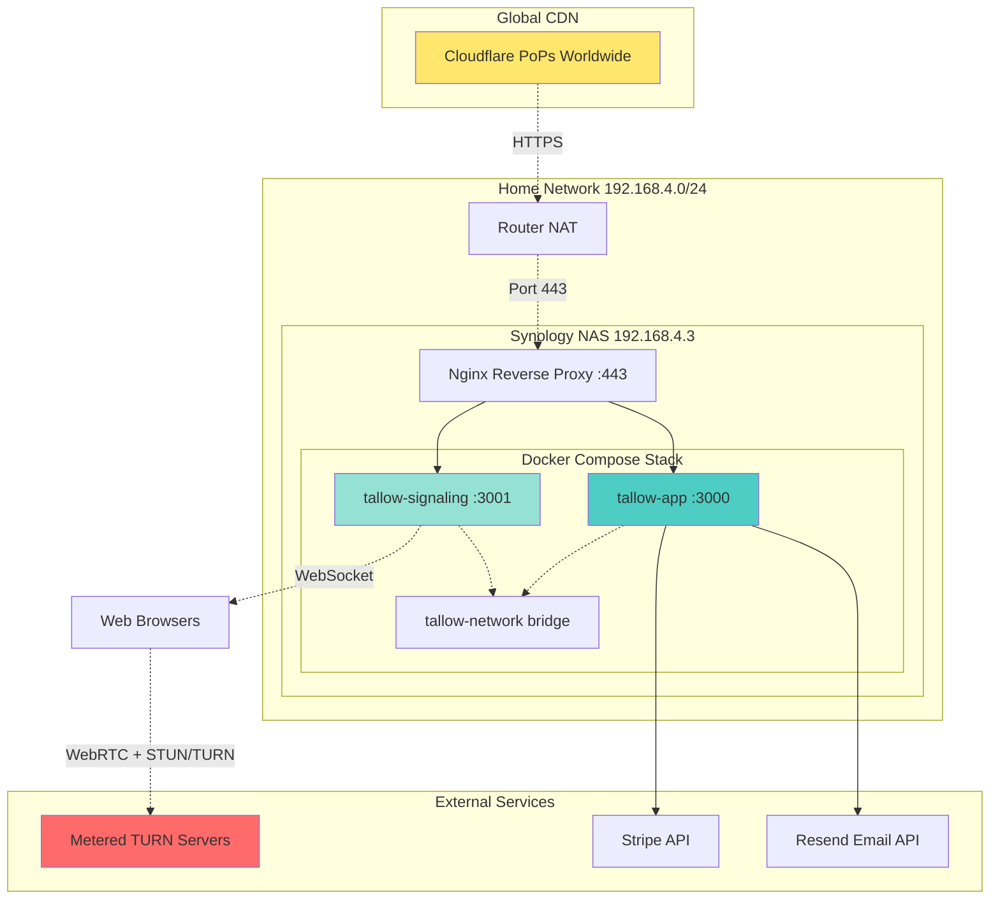
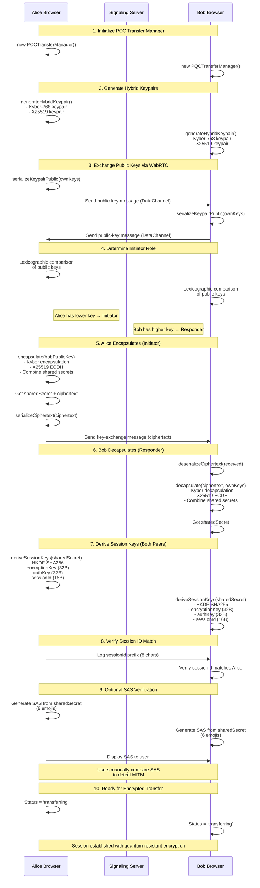

# Tallow Architecture Documentation

**Version:** 1.0.0
**Last Updated:** 2026-01-25
**Status:** Production

---

## Table of Contents

1. [System Overview](#system-overview)
2. [System Architecture Diagram](#system-architecture-diagram)
3. [Component Hierarchy](#component-hierarchy)
4. [Data Flow Architecture](#data-flow-architecture)
5. [Security Architecture](#security-architecture)
6. [Deployment Topology](#deployment-topology)
7. [PQC Key Exchange Flow](#pqc-key-exchange-flow)
8. [Technology Stack](#technology-stack)
9. [Design Principles](#design-principles)

---

## System Overview

Tallow is a secure, privacy-focused peer-to-peer file sharing platform with post-quantum cryptography (PQC). All file transfers are end-to-end encrypted and occur directly between peers via WebRTC, with no server-side storage of file contents.

### Key Features

- **Post-Quantum Cryptography**: Hybrid ML-KEM-768 (Kyber) + X25519 key exchange
- **End-to-End Encryption**: AES-256-GCM with client-side encryption
- **Zero-Knowledge Architecture**: Server never sees file contents or encryption keys
- **Privacy-First**: IP leak prevention, traffic obfuscation, relay-only connections
- **Modern Web Stack**: Next.js 16, React 19, TypeScript, WebRTC

---

## System Architecture Diagram



### Description

The architecture follows a client-server model for signaling and API services, but file transfers occur peer-to-peer:

- **Client Layer**: React-based web application with WebRTC and PQC capabilities
- **CDN Layer**: Cloudflare provides DDoS protection, SSL termination, and global distribution
- **Infrastructure Layer**: Self-hosted on Synology NAS with Docker containerization
- **Backend Layer**: Next.js API routes for payments/email, Socket.IO for WebRTC signaling
- **P2P Layer**: Direct WebRTC connections between peers for file transfer

---

## Component Hierarchy



### Description

Components are organized in a layered architecture:

1. **Application Layer**: Next.js pages and routing
2. **UI Components**: Reusable React components with Radix UI primitives
3. **Business Logic**: Custom React hooks for state management
4. **Core Libraries**: Transfer management, cryptography, signaling
5. **Infrastructure**: Authentication, rate limiting, monitoring, security initialization

**Key Dependencies:**
- UI components consume business logic hooks
- Hooks orchestrate core libraries
- Core libraries are pure TypeScript modules (no React dependencies)
- Infrastructure provides cross-cutting concerns (auth, monitoring, security)

---

## Data Flow Architecture

```mermaid
sequenceDiagram
    participant U1 as User A Browser
    participant S as Signaling Server
    participant U2 as User B Browser
    participant T as TURN Server

    Note over U1,U2: 1. Connection Establishment
    U1->>S: Connect via WebSocket
    U2->>S: Connect via WebSocket
    U1->>S: Join room "RedLionDeer"
    U2->>S: Join room "RedLionDeer"
    S-->>U1: Peer joined
    S-->>U2: Peer joined

    Note over U1,U2: 2. WebRTC Signaling
    U1->>U1: Generate ICE candidates
    U1->>S: Send encrypted offer (SDP)
    S-->>U2: Forward encrypted offer
    U2->>U2: Generate ICE candidates
    U2->>S: Send encrypted answer (SDP)
    S-->>U1: Forward encrypted answer
    U1->>S: Send ICE candidates
    S-->>U2: Forward ICE candidates
    U2->>S: Send ICE candidates
    S-->>U1: Forward ICE candidates

    Note over U1,U2: 3. NAT Traversal (if needed)
    U1->>T: STUN/TURN request
    T-->>U1: Relay allocated
    U2->>T: STUN/TURN request
    T-->>U2: Relay allocated

    Note over U1,U2: 4. Direct P2P Connection
    U1<-->U2: Establish DataChannel

    Note over U1,U2: 5. PQC Key Exchange
    U1->>U1: Generate Kyber+X25519 keypair
    U2->>U2: Generate Kyber+X25519 keypair
    U1->>U2: Send public key (DataChannel)
    U2->>U1: Send public key (DataChannel)
    U1->>U1: Encapsulate → shared secret
    U1->>U2: Send ciphertext (DataChannel)
    U2->>U2: Decapsulate → shared secret
    U1->>U1: Derive AES-256-GCM keys
    U2->>U2: Derive AES-256-GCM keys

    Note over U1,U2: 6. Optional SAS Verification
    U1-->>U1: Compute SAS from shared secret
    U2-->>U2: Compute SAS from shared secret
    U1->>U2: Display SAS for manual comparison

    Note over U1,U2: 7. Encrypted File Transfer
    U1->>U1: Encrypt file chunks (AES-GCM)
    loop For each chunk
        U1->>U2: Send encrypted chunk + nonce + hash
        U2->>U2: Decrypt & verify chunk
        U2->>U1: Send ACK
    end
    U2->>U2: Reassemble & verify file hash
    U2->>U2: Trigger download

    Note over U1,U2: 8. Session Cleanup
    U1->>U1: Zero out keys in memory
    U2->>U2: Zero out keys in memory
    U1->>S: Disconnect
    U2->>S: Disconnect
```

### Description

The data flow follows these stages:

1. **Connection Establishment**: Users connect to signaling server and join a shared room via connection code
2. **WebRTC Signaling**: Exchange SDP offers/answers and ICE candidates through signaling server (encrypted)
3. **NAT Traversal**: Use STUN/TURN servers if direct P2P connection is blocked by firewalls
4. **Direct P2P Connection**: Establish WebRTC DataChannel for file transfer (bypasses server)
5. **PQC Key Exchange**: Perform hybrid Kyber + X25519 key exchange to derive shared secret
6. **SAS Verification**: Optional manual verification via Short Authentication String to prevent MITM attacks
7. **Encrypted File Transfer**: Stream encrypted chunks directly peer-to-peer with acknowledgments
8. **Session Cleanup**: Securely wipe cryptographic material from memory

**Important:** The signaling server never sees file contents or encryption keys. All file data travels peer-to-peer.

---

## Security Architecture



### Description

Security is implemented across multiple layers:

**Client-Side Security:**
- **Hybrid PQC**: ML-KEM-768 (Kyber) + X25519 for quantum-resistant key exchange
- **Strong Encryption**: AES-256-GCM for file encryption with random nonces
- **Secure Storage**: Non-extractable CryptoKeys in IndexedDB, AES-256-GCM for localStorage
- **Memory Safety**: Explicit zeroing of sensitive data (keys, shared secrets)
- **SAS Verification**: Manual verification via Short Authentication String to detect MITM

**Transport Security:**
- **TLS 1.3**: All HTTP traffic encrypted via Cloudflare
- **DTLS-SRTP**: WebRTC connections encrypted with DTLS 1.2
- **Relay-Only Mode**: Force TURN relay to prevent IP address leaks
- **Traffic Obfuscation**: Optional padding and decoy packets to thwart traffic analysis
- **Candidate Filtering**: Block host/srflx candidates to prevent IP disclosure

**Server-Side Security:**
- **API Key Auth**: X-API-Key header validation for protected endpoints
- **Rate Limiting**: Per-IP throttling to prevent abuse (3-5 req/min)
- **CSRF Protection**: Double-submit cookie pattern
- **Input Validation**: Zod schemas for all API inputs
- **Security Headers**: HSTS, CSP, X-Frame-Options, etc.

**Privacy Features:**
- **Zero Server Storage**: Files never touch server disk/memory
- **No File Logging**: Server logs only metadata (size, timestamp), not contents
- **Ephemeral Keys**: Session keys destroyed after transfer
- **Metadata Stripping**: EXIF removal from images before transfer
- **Zero-Knowledge**: Server cannot decrypt files even if compromised

**Threat Mitigation:**
- **MITM Prevention**: SAS verification + authenticated signaling
- **Quantum Resistance**: Hybrid PQC protects against future quantum attacks
- **DDoS Protection**: Cloudflare CDN absorbs attacks
- **XSS Protection**: Content Security Policy headers
- **Side-Channel Hardening**: Constant-time operations, memory wiping

---

## Deployment Topology



### Deployment Configuration

**Infrastructure:**
- **Hosting**: Self-hosted on Synology DS920+ NAS
- **Network**: Home network with Cloudflare CDN in front
- **Containers**: Docker Compose with 2 services (app + signaling)
- **Reverse Proxy**: Synology DSM built-in Nginx
- **Port Forwarding**: Router forwards 443 → NAS:443

**Services:**

1. **tallow-app** (Next.js)
   - Port: 3000 (internal)
   - Path: `/` → All app routes
   - Environment: Production build
   - Restart: Always

2. **tallow-signaling** (Socket.IO)
   - Port: 3001 (internal)
   - Path: `/signaling/*` → WebSocket signaling
   - Environment: Node.js standalone
   - Restart: Always

**Network Flow:**
```
Internet
  ↓
Cloudflare CDN (SSL termination, DDoS protection)
  ↓
Public IP (Dynamic DNS)
  ↓
Router NAT (Port 443 forwarding)
  ↓
Synology NAS (192.168.4.3:443)
  ↓
Nginx Reverse Proxy
  ├─→ / → tallow-app:3000
  └─→ /signaling → tallow-signaling:3001
```

**Security:**
- Cloudflare SSL mode: **Full** (encrypts between Cloudflare and NAS)
- WebSocket proxying enabled for signaling
- No direct exposure of internal ports (all via reverse proxy)
- Docker network isolation between containers

**Scalability:**
- CDN caching for static assets (images, CSS, JS)
- WebRTC P2P eliminates file transfer load on server
- Signaling server handles 1000+ concurrent connections
- Horizontal scaling possible via Docker Swarm/Kubernetes

---

## PQC Key Exchange Flow



### PQC Implementation Details

**Hybrid Key Exchange:**
```typescript
// 1. Generate keypairs
const kyberKeypair = await kyber768.generateKeyPair();
const x25519PrivateKey = x25519.utils.randomSecretKey();
const x25519PublicKey = x25519.getPublicKey(x25519PrivateKey);

// 2. Encapsulate (Initiator)
const { ciphertext: kyberCt, sharedSecret: kyberSS } =
    await kyber768.encapsulate(peerKyberPublicKey);
const x25519SS = x25519.getSharedSecret(x25519PrivateKey, peerX25519PublicKey);

// 3. Combine shared secrets via XOR
const combinedSecret = new Uint8Array(32);
for (let i = 0; i < 32; i++) {
    combinedSecret[i] = kyberSS[i] ^ x25519SS[i];
}

// 4. Derive session keys with HKDF
const sessionKeys = hkdf(sha256, combinedSecret, salt, info, 80);
// Extract: encryptionKey (0-31), authKey (32-63), sessionId (64-79)
```

**Why Hybrid?**
- **Kyber**: Quantum-resistant (lattice-based), NIST-standardized
- **X25519**: Classical security, battle-tested, fast
- **Combined**: Attacker must break BOTH algorithms to compromise transfer
- **Future-proof**: Protected against both classical and quantum computers

**Security Guarantees:**
- Forward secrecy (ephemeral keys destroyed after session)
- Mutual authentication (both peers verify shared secret via SAS)
- MITM detection (SAS comparison)
- Replay protection (random nonces per chunk)
- Integrity protection (BLAKE3 hash per chunk)

---

## Technology Stack

### Frontend

| Technology | Version | Purpose |
|------------|---------|---------|
| **Next.js** | 16.1.2 | React framework with App Router |
| **React** | 19.2.3 | UI library |
| **TypeScript** | 5.x | Type-safe development |
| **Tailwind CSS** | 4.x | Utility-first styling |
| **Radix UI** | Latest | Accessible component primitives |
| **Framer Motion** | 12.26.2 | Animations |
| **simple-peer** | 9.11.1 | WebRTC wrapper |

### Cryptography

| Technology | Version | Purpose |
|------------|---------|---------|
| **pqc-kyber** | 0.7.0 | Post-quantum Kyber-768 |
| **@noble/curves** | 2.0.1 | X25519 elliptic curve |
| **@noble/hashes** | 2.0.1 | BLAKE3, SHA-256, HKDF |
| **Web Crypto API** | Native | AES-256-GCM encryption |

### Backend

| Technology | Version | Purpose |
|------------|---------|---------|
| **Socket.IO** | 4.8.3 | WebRTC signaling server |
| **Stripe** | 20.2.0 | Payment processing |
| **Resend** | 6.7.0 | Transactional emails |
| **Zod** | Latest | Schema validation |

### Infrastructure

| Technology | Version | Purpose |
|------------|---------|---------|
| **Docker** | Latest | Containerization |
| **Docker Compose** | Latest | Multi-container orchestration |
| **Nginx** | Latest | Reverse proxy (Synology) |
| **Cloudflare** | - | CDN, DDoS protection, SSL |

### Development

| Technology | Version | Purpose |
|------------|---------|---------|
| **Playwright** | 1.58.0 | E2E testing |
| **Vitest** | 4.0.18 | Unit testing |
| **ESLint** | 9.x | Linting |

---

## Design Principles

### 1. Privacy by Design

**Principle:** User privacy is not optional; it's built into the architecture.

**Implementation:**
- Files never stored on server (zero-knowledge architecture)
- End-to-end encryption with client-side keys
- No logging of file contents or filenames
- IP leak prevention via relay-only mode
- Metadata stripping before transfer

### 2. Security by Default

**Principle:** Secure defaults without user configuration.

**Implementation:**
- PQC enabled by default (quantum-resistant)
- HTTPS-only (HSTS enabled)
- SAS verification recommended but not forced
- Secure storage for all sensitive data (encrypted localStorage)
- Memory wiping after session ends

### 3. Transparency

**Principle:** Users should understand what's happening with their data.

**Implementation:**
- Open-source codebase
- Clear visual indicators (connection status, encryption status)
- SAS verification for MITM detection
- Privacy warnings when relay-only is disabled
- Detailed logs (in development mode)

### 4. Defense in Depth

**Principle:** Multiple layers of security, not a single point of failure.

**Implementation:**
- Hybrid PQC (Kyber + X25519)
- Encrypted signaling (prevents passive eavesdropping)
- SAS verification (prevents active MITM)
- Rate limiting (prevents abuse)
- CSRF protection (prevents cross-site attacks)
- Input validation (prevents injection)

### 5. Fail Secure

**Principle:** Security failures should not compromise user data.

**Implementation:**
- Transfer aborts if key exchange fails
- Transfer aborts if chunk hash mismatch
- Connection closes if verification fails (user choice)
- API rejects invalid inputs (no silent failures)
- Errors logged but sensitive data redacted

### 6. Minimal Trust

**Principle:** Trust no component more than necessary.

**Implementation:**
- Signaling server cannot decrypt transfers (zero-knowledge)
- Server cannot impersonate peers (authenticated key exchange)
- CDN cannot modify code (Subresource Integrity)
- TURN servers cannot decrypt (DTLS)
- Browser extensions cannot extract keys (non-extractable CryptoKeys)

### 7. Performance with Security

**Principle:** Security should not cripple usability.

**Implementation:**
- Lazy-loading PQC libraries (reduces initial load)
- Chunked transfer with progress updates (responsive UI)
- Web Workers for crypto operations (non-blocking)
- Efficient encoding (BLAKE3 hashing, minimal overhead)
- CDN caching for static assets

### 8. Graceful Degradation

**Principle:** Core functionality works even when advanced features fail.

**Implementation:**
- Falls back to X25519-only if Kyber fails to load
- Falls back to localStorage if IndexedDB unavailable
- Works without email service (donation confirmations)
- Works without TURN servers (if NAT allows)
- Works on older browsers (progressive enhancement)

---

## Additional Resources

- [PQC Integration Guide](./PQC_INTEGRATION.md) - Detailed PQC implementation
- [Security Enhancements](./SECURITY_ENHANCEMENTS.md) - Security features and fixes
- [API Documentation](./API_EXAMPLES.md) - API usage examples
- [Deployment Guide](./DEPLOYMENT.md) - Production deployment instructions
- [OpenAPI Specification](./openapi.yml) - API schema

---

## Glossary

- **PQC**: Post-Quantum Cryptography - encryption resistant to quantum computers
- **ML-KEM**: Module-Lattice-Based Key-Encapsulation Mechanism (formerly Kyber)
- **X25519**: Elliptic curve Diffie-Hellman key exchange
- **SAS**: Short Authentication String - visual verification to detect MITM
- **WebRTC**: Web Real-Time Communication - browser-to-browser P2P protocol
- **TURN**: Traversal Using Relays around NAT - relay server for P2P when direct fails
- **STUN**: Session Traversal Utilities for NAT - helps discover public IP
- **DataChannel**: WebRTC API for sending arbitrary data peer-to-peer
- **Zero-Knowledge**: Server design where server cannot access user data

---

**Maintained by:** Tallow Development Team
**License:** MIT
**Questions?** See [README.md](./README.md) for contact info
