# Architecture Diagrams - Usage Guide

## Quick Start

The architecture diagrams are now available at `/docs/architecture` and automatically integrated into the documentation sidebar.

## Using the MermaidDiagram Component

### Basic Usage

```tsx
import { MermaidDiagram } from '@/components/docs/MermaidDiagram';
import { architectureDiagrams } from '@/lib/docs/architecture-diagrams';

export function MyPage() {
  return (
    <MermaidDiagram
      diagram={architectureDiagrams.SYSTEM_OVERVIEW}
      title="System Overview"
      description="High-level architecture of Tallow"
    />
  );
}
```

### Component Props

```typescript
interface MermaidDiagramProps {
  diagram: string;           // Mermaid diagram definition (required)
  title?: string;           // Diagram title displayed above
  description?: string;     // Description text below title
  className?: string;       // Additional CSS classes
}
```

### Available Diagrams

```typescript
// All diagrams available from lib/docs/architecture-diagrams.ts
architectureDiagrams.SYSTEM_OVERVIEW
architectureDiagrams.CRYPTO_ARCHITECTURE
architectureDiagrams.TRANSFER_FLOW
architectureDiagrams.DISCOVERY_FLOW
architectureDiagrams.STATE_MANAGEMENT
architectureDiagrams.DEPLOYMENT_ARCHITECTURE
```

## Creating New Diagrams

### Step 1: Define the Diagram

Add to `lib/docs/architecture-diagrams.ts`:

```typescript
export const MY_CUSTOM_DIAGRAM = `graph TD
    A["Component A"]
    B["Component B"]
    A --> B

    style A fill:#5e5ce6,stroke:#7b7bff,color:#fff
    style B fill:#5e5ce6,stroke:#7b7bff,color:#fff`;
```

### Step 2: Export from Type

Update the type definition:

```typescript
export const architectureDiagrams = {
  SYSTEM_OVERVIEW,
  CRYPTO_ARCHITECTURE,
  TRANSFER_FLOW,
  DISCOVERY_FLOW,
  STATE_MANAGEMENT,
  DEPLOYMENT_ARCHITECTURE,
  MY_CUSTOM_DIAGRAM,  // Add here
} as const;
```

### Step 3: Use in Documentation

```tsx
import { MermaidDiagram } from '@/components/docs/MermaidDiagram';
import { architectureDiagrams } from '@/lib/docs/architecture-diagrams';

export function MyDocPage() {
  return (
    <MermaidDiagram
      diagram={architectureDiagrams.MY_CUSTOM_DIAGRAM}
      title="My Diagram"
      description="Description of what this shows"
    />
  );
}
```

## Mermaid Diagram Syntax

### Flowchart / Graph


### Sequence Diagram


### Styling Nodes


## Color Scheme

Use Tallow's design token colors for consistency:

### Purple (Primary)
- Light: `#9a9aff` - Primary 400
- Medium: `#5e5ce6` - Primary 500 (main)
- Dark: `#2d2b9a` - Primary 800

### Semantic Colors

**Success (Green)**
```
fill:#22c55e,stroke:#16a34a
```

**Warning (Amber)**
```
fill:#f59e0b,stroke:#d97706
```

**Error (Red)**
```
fill:#ef4444,stroke:#dc2626
```

**Info (Blue)**
```
fill:#3b82f6,stroke:#2563eb
```

**Secondary (Cyan)**
```
fill:#06b6d4,stroke:#0891b2
```

### Text Colors
- Primary Text: `color:#fff` (white text on dark backgrounds)
- Inverse: `color:#1f2937` (dark text on light backgrounds)

## Example: Custom Component Diagram

```tsx
export const CUSTOM_COMPONENT_FLOW = `graph LR
    subgraph User["👤 User Layer"]
        UI["React Component"]
    end

    subgraph Logic["⚙️ Logic Layer"]
        Hook["Custom Hook"]
        Store["Zustand Store"]
    end

    subgraph Data["📊 Data Layer"]
        API["API Call"]
        DB["Database"]
    end

    UI -->|useCustomHook| Hook
    Hook -->|setState| Store
    Store -->|query| API
    API -->|fetch| DB

    style User fill:#5e5ce6,stroke:#7b7bff,color:#fff,stroke-width:2px
    style Logic fill:#8b5cf6,stroke:#a78bfa,color:#fff,stroke-width:2px
    style Data fill:#06b6d4,stroke:#22d3ee,color:#000,stroke-width:2px`;
```

## Styling Guidelines

### Node Colors by Type

**Input/Output**
```
fill:#10b981,stroke:#34d399,color:#fff
```

**Processing**
```
fill:#5e5ce6,stroke:#7b7bff,color:#fff
```

**Storage/Data**
```
fill:#f59e0b,stroke:#fbbf24,color:#1f2937
```

**Error/Warning**
```
fill:#ef4444,stroke:#f87171,color:#fff
```

### Text Colors

**On Dark Backgrounds** - Use white or light colors
```
color:#fff
```

**On Light Backgrounds** - Use dark colors
```
color:#1f2937
```

## Advanced Features

### Clickable Nodes


### Subgraphs

```mermaid
graph TD
    subgraph Frontend["🌐 Frontend"]
        A["Component A"]
        B["Component B"]
    end

    subgraph Backend["🔧 Backend"]
        C["API Server"]
    end

    A --> C
    B --> C
```



### Different Edge Types

```mermaid
graph TD
    A --> B        %% Solid arrow
    C -.-> D       %% Dotted line
    E ==> F        %% Thick arrow
    G -- text --> H  %% With label
```

## Performance Tips

1. **Keep diagrams focused** - Each diagram should show one concept
2. **Limit node count** - 20-30 nodes max for clarity
3. **Use subgraphs** - Group related components
4. **Lazy load** - MermaidDiagram uses dynamic imports automatically
5. **Avoid complex layouts** - Stick to LR, TB, or TD directions

## Accessibility

The MermaidDiagram component includes:
- ✅ Alt text via `title` prop
- ✅ Description text via `description` prop
- ✅ Loading state aria-label
- ✅ Semantic HTML structure
- ✅ High contrast theme support
- ✅ Reduced motion support

### Example with Accessibility

```tsx
<MermaidDiagram
  diagram={architectureDiagrams.SYSTEM_OVERVIEW}
  title="System Architecture Overview"
  description="Shows how browser clients, signaling servers, and P2P connections interact in Tallow"
/>
```

## Troubleshooting

### Diagram Not Rendering

1. **Check syntax** - Use Mermaid syntax validator
2. **Check colors** - Remove any invalid color formats
3. **Check imports** - Ensure `architectureDiagrams` is imported
4. **Check console** - Look for error messages

### Styling Issues

1. **Use valid CSS** - Colors must be hex, rgb, or named colors
2. **Match theme** - Use design tokens for consistency
3. **Test themes** - Verify in dark/light/high-contrast modes
4. **Mobile test** - Check on smaller screens

### Slow Rendering

1. **Reduce nodes** - Split large diagrams into smaller ones
2. **Simplify structure** - Fewer connections between nodes
3. **Use subgraphs** - Group related nodes
4. **Avoid custom HTML** - Use plain text labels

## Integration Checklist

- [ ] Mermaid library in package.json (`npm install mermaid`)
- [ ] Diagrams defined in `lib/docs/architecture-diagrams.ts`
- [ ] Components using MermaidDiagram imported correctly
- [ ] Routes added for new documentation pages
- [ ] Links updated in DocsSidebar
- [ ] Design tokens available in globals.css
- [ ] Tested in dark/light themes
- [ ] Tested on mobile devices
- [ ] SEO metadata added for new pages
- [ ] Links to related documentation pages

## Related Files

**Core Components**
- `/components/docs/MermaidDiagram.tsx` - Main component
- `/components/docs/MermaidDiagram.module.css` - Styling

**Diagram Definitions**
- `/lib/docs/architecture-diagrams.ts` - All diagram strings

**Documentation**
- `/app/docs/architecture/page.tsx` - Architecture docs page
- `/app/docs/architecture/page.module.css` - Page styling

**Navigation**
- `/components/docs/DocsSidebar.tsx` - Updated with Architecture link

## Useful Resources

- [Mermaid Documentation](https://mermaid.js.org/)
- [Mermaid Syntax Reference](https://mermaid.js.org/syntax/flowchart.html)
- [Mermaid Live Editor](https://mermaid.live/) - Test diagrams
- [Design Tokens Reference](/app/globals.css) - Color palette

## Common Patterns

### System Architecture


### Data Flow


### State Management


## Questions & Support

For issues or questions about the architecture diagrams:

1. Check `/docs/architecture` for examples
2. Review `/ARCHITECTURE_DIAGRAMS_IMPLEMENTATION.md` for detailed info
3. Check Mermaid documentation for syntax help
4. Review existing diagrams in `lib/docs/architecture-diagrams.ts`

---

Happy documenting! The architecture diagrams make complex system designs easy to understand and share with your team.
