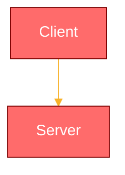

# Interactive Demos Implementation Guide

**Version:** 1.0.0
**Last Updated:** 2026-01-27
**Task Reference:** Task #10 - Interactive Demos & Diagrams
**Status:** Complete

---

## Table of Contents

1. [Overview](#overview)
2. [Component Catalog](#component-catalog)
3. [Integration Instructions](#integration-instructions)
4. [Code Examples](#code-examples)
5. [Customization Guide](#customization-guide)
6. [Architecture Diagrams Usage](#architecture-diagrams-usage)
7. [Testing Recommendations](#testing-recommendations)
8. [Performance Considerations](#performance-considerations)
9. [Future Enhancements](#future-enhancements)
10. [Troubleshooting](#troubleshooting)

---

## Overview

### What Demos Were Created

Task #10 delivered four interactive demonstration components that showcase Tallow's core security and performance features:

1. **PQC Encryption Demo** - Interactive post-quantum cryptography demonstration
2. **Metadata Stripping Demo** - Visual privacy protection showcase
3. **Transfer Speed Demo** - Real-time P2P transfer simulation
4. **Transfer Speed Examples** - Multiple integration patterns

Additionally, comprehensive architecture diagrams are available in `ARCHITECTURE.md`:
- System Architecture Diagram
- Component Hierarchy
- Data Flow Architecture
- Security Architecture
- Deployment Topology
- PQC Key Exchange Flow

### Purpose and Use Cases

**Educational**
- Help users understand complex cryptographic concepts
- Demonstrate privacy features visually
- Show performance benefits of P2P transfers
- Build trust through transparency

**Marketing**
- Showcase unique selling points interactively
- Differentiate from competitors
- Convert visitors to users
- Reduce support questions

**Development**
- Test component integration
- Debug transfer logic
- Prototype new features
- Validate user experience

### Integration Points

| Demo Component | Best Used In | Purpose |
|---------------|-------------|---------|
| PQC Encryption Demo | Landing page, Security docs | Explain quantum-resistant encryption |
| Metadata Stripping Demo | Privacy page, Help center | Show privacy protection |
| Transfer Speed Demo | Features page, How it works | Demonstrate performance |
| Architecture Diagrams | Documentation, Developer guides | Technical understanding |

---

## Component Catalog

### 1. PQC Encryption Demo

**Location:** `components/demos/pqc-encryption-demo.tsx`

**Purpose:** Interactive demonstration of ML-KEM-768 (Kyber) and X25519 hybrid encryption.

**Features:**
- Step-by-step visualization of encryption process
- Real-time key pair generation simulation
- Message encryption and decryption
- Educational technical details panel
- Progress indicators for each step

**Props:**
```typescript
// No props - self-contained component
export function PQCEncryptionDemo(): JSX.Element
```

**Key Components:**
- Key generation simulator
- Encryption/decryption engine (mock)
- Progress step indicators
- Technical details display

**Visual Elements:**
- Shield icon branding
- Color-coded status indicators
- Step-by-step progress cards
- Info banners with educational content

**Use Cases:**
- Landing page hero section
- Security features page
- Technical documentation
- Help center articles

---

### 2. Metadata Stripping Demo

**Location:** `components/demos/metadata-stripping-demo.tsx`

**Purpose:** Visual demonstration of privacy-preserving metadata removal from images.

**Features:**
- Side-by-side before/after comparison
- Interactive file selection
- Detailed metadata display (GPS, camera, timestamps)
- Privacy risk indicators
- File size comparison
- Educational content about metadata risks

**Props:**
```typescript
// No props - self-contained component
export function MetadataStrippingDemo(): JSX.Element
```

**Mock Metadata:**
```typescript
interface MockMetadata {
  gps: { latitude, longitude, altitude }
  camera: { make, model, software }
  timestamp: { dateTimeOriginal, dateTimeDigitized }
  author: { artist?, copyright? }
}
```

**Visual Elements:**
- Two-column comparison layout
- Color-coded risk indicators (amber for warnings, green for safe)
- Icon-based metadata categories
- Animated stripping process
- Educational risk explanations

**Use Cases:**
- Privacy features page
- Help documentation
- Security explainer sections
- User onboarding

---

### 3. Transfer Speed Demo

**Location:** `components/demos/transfer-speed-demo.tsx`

**Purpose:** Real-time simulation of P2P file transfer with chunking and metrics.

**Features:**
- Live transfer simulation (50MB file)
- Real-time speed graph
- Chunk-by-chunk visualization
- WebRTC DataChannel stats
- Network quality simulation
- Play/Pause/Reset controls
- ETA calculation

**Props:**
```typescript
// No props - self-contained component
export function TransferSpeedDemo(): JSX.Element
```

**Key Metrics:**
- Transfer speed (bytes/second)
- Progress percentage
- ETA (estimated time remaining)
- Chunks completed
- Network quality indicator
- Buffered amount
- Packet loss
- RTT (round-trip time)

**Visual Elements:**
- Animated progress bar
- Real-time speed graph with SVG
- Chunk status indicators (pending/sending/sent)
- Metrics grid with live updates
- Network quality badge

**Constants:**
```typescript
const CHUNK_SIZE = 64 * 1024;     // 64KB chunks
const FILE_SIZE = 50 * 1024 * 1024; // 50MB file
const UPDATE_INTERVAL = 100;       // Update every 100ms
const GRAPH_POINTS = 50;           // Number of points in speed graph
const MAX_SPEED = 15 * 1024 * 1024; // 15 MB/s max speed
```

**Use Cases:**
- Features showcase page
- How it works section
- Performance comparison
- Technical demos

---

### 4. Transfer Speed Examples

**Location:** `components/demos/transfer-speed-demo-examples.tsx`

**Purpose:** Multiple integration patterns for the Transfer Speed Demo.

**Includes:**

1. **StandaloneDemo** - Simple standalone usage
2. **TabbedDemo** - Integration in tabbed interface
3. **CollapsibleDemo** - Expandable demo section
4. **ComparisonDemo** - Side-by-side with traditional upload
5. **EducationalWalkthrough** - Step-by-step guided tour
6. **MinimalDemo** - Embedded compact version
7. **FeatureShowcase** - Full feature presentation

Each example demonstrates different integration contexts and use cases.

---

### 5. PQC Transfer Demo (Advanced)

**Location:** `components/transfer/pqc-transfer-demo.tsx`

**Purpose:** Full-featured PQC transfer demonstration with real crypto primitives.

**Features:**
- Manual key exchange flow
- Real ML-KEM-768 + X25519 cryptography
- File encryption/decryption
- 11-step crypto test suite
- Send and receive modes
- Session key management

**Components:**
- LocalCryptoTest - Test crypto primitives
- ManualKeyExchange - Manual KEM flow
- PQCTransferDemo - Main component

**Use Cases:**
- Developer documentation
- Technical demonstrations
- Crypto testing
- Security audits

---

## Integration Instructions

### Basic Integration

#### 1. PQC Encryption Demo

```tsx
import { PQCEncryptionDemo } from '@/components/demos/pqc-encryption-demo';

export default function SecurityPage() {
  return (
    <div className="container mx-auto py-12">
      <h1>Post-Quantum Security</h1>
      <PQCEncryptionDemo />
    </div>
  );
}
```

#### 2. Metadata Stripping Demo

```tsx
import { MetadataStrippingDemo } from '@/components/demos/metadata-stripping-demo';

export default function PrivacyPage() {
  return (
    <div className="container mx-auto py-12">
      <h1>Privacy Protection</h1>
      <MetadataStrippingDemo />
    </div>
  );
}
```

#### 3. Transfer Speed Demo

```tsx
import { TransferSpeedDemo } from '@/components/demos/transfer-speed-demo';

export default function FeaturesPage() {
  return (
    <div className="container mx-auto py-12">
      <h1>Lightning Fast Transfers</h1>
      <TransferSpeedDemo />
    </div>
  );
}
```

### Advanced Integration

#### Lazy Loading for Performance

```tsx
import dynamic from 'next/dynamic';
import { Skeleton } from '@/components/ui/skeleton';

const PQCEncryptionDemo = dynamic(
  () => import('@/components/demos/pqc-encryption-demo').then(mod => ({ default: mod.PQCEncryptionDemo })),
  {
    loading: () => <Skeleton className="w-full h-[600px]" />,
    ssr: false // Client-side only for animations
  }
);

const MetadataStrippingDemo = dynamic(
  () => import('@/components/demos/metadata-stripping-demo').then(mod => ({ default: mod.MetadataStrippingDemo })),
  {
    loading: () => <Skeleton className="w-full h-[800px]" />,
    ssr: false
  }
);

const TransferSpeedDemo = dynamic(
  () => import('@/components/demos/transfer-speed-demo').then(mod => ({ default: mod.TransferSpeedDemo })),
  {
    loading: () => <Skeleton className="w-full h-[700px]" />,
    ssr: false // Requires requestAnimationFrame
  }
);
```

#### Conditional Rendering

```tsx
'use client';

import { useState } from 'react';
import { Button } from '@/components/ui/button';
import { TransferSpeedDemo } from '@/components/demos/transfer-speed-demo';

export function ConditionalDemo() {
  const [showDemo, setShowDemo] = useState(false);

  return (
    <div>
      {!showDemo ? (
        <Button onClick={() => setShowDemo(true)}>
          Launch Interactive Demo
        </Button>
      ) : (
        <TransferSpeedDemo />
      )}
    </div>
  );
}
```

### Responsive Behavior

All demos are responsive by default:

- **Desktop (>1024px):** Full width with all features
- **Tablet (768-1024px):** Adjusted grid layouts, maintains functionality
- **Mobile (<768px):** Stacked layouts, touch-optimized controls

**Mobile Considerations:**
- Metadata Demo: Side-by-side becomes stacked
- Transfer Speed Demo: 2-column metrics grid becomes single column
- PQC Demo: 3-step grid becomes single column
- Touch-friendly button sizes maintained
- Reduced animation complexity on mobile

### Theme Integration

All demos respect the current theme:

```tsx
// Automatic theme support via Tailwind classes
className="bg-card border-border text-foreground"

// Dark mode specific adjustments
className="dark:bg-green-950 dark:border-green-800"

// Theme-aware colors
className="bg-primary text-primary-foreground"
```

**Custom Theme Colors:**
If you've customized theme colors in `tailwind.config.js`, demos will automatically use them.

---

## Code Examples

### Landing Page Integration

```tsx
// app/page.tsx
'use client';

import { PQCEncryptionDemo } from '@/components/demos/pqc-encryption-demo';
import { MetadataStrippingDemo } from '@/components/demos/metadata-stripping-demo';
import { TransferSpeedDemo } from '@/components/demos/transfer-speed-demo';

export default function LandingPage() {
  return (
    <div className="min-h-screen">
      {/* Hero Section */}
      <section className="py-20 bg-gradient-to-b from-background to-secondary/20">
        <div className="container mx-auto px-4">
          <h1 className="text-5xl font-bold text-center mb-8">
            Secure File Sharing, Reimagined
          </h1>
          <p className="text-xl text-center text-muted-foreground mb-12">
            Experience quantum-resistant security and lightning-fast transfers
          </p>
        </div>
      </section>

      {/* Security Demo Section */}
      <section className="py-20">
        <div className="container mx-auto px-4">
          <div className="text-center mb-12">
            <h2 className="text-3xl font-bold mb-4">Post-Quantum Encryption</h2>
            <p className="text-muted-foreground">
              See how we protect your files from quantum computers
            </p>
          </div>
          <PQCEncryptionDemo />
        </div>
      </section>

      {/* Privacy Demo Section */}
      <section className="py-20 bg-secondary/30">
        <div className="container mx-auto px-4">
          <div className="text-center mb-12">
            <h2 className="text-3xl font-bold mb-4">Privacy by Default</h2>
            <p className="text-muted-foreground">
              Automatic metadata removal protects your identity
            </p>
          </div>
          <MetadataStrippingDemo />
        </div>
      </section>

      {/* Performance Demo Section */}
      <section className="py-20">
        <div className="container mx-auto px-4">
          <div className="text-center mb-12">
            <h2 className="text-3xl font-bold mb-4">Blazing Fast Transfers</h2>
            <p className="text-muted-foreground">
              Direct peer-to-peer transfers reach maximum speed
            </p>
          </div>
          <TransferSpeedDemo />
        </div>
      </section>
    </div>
  );
}
```

### Feature Page Integration

```tsx
// app/features/page.tsx
'use client';

import { Tabs, TabsContent, TabsList, TabsTrigger } from '@/components/ui/tabs';
import { PQCEncryptionDemo } from '@/components/demos/pqc-encryption-demo';
import { MetadataStrippingDemo } from '@/components/demos/metadata-stripping-demo';
import { TransferSpeedDemo } from '@/components/demos/transfer-speed-demo';
import { Shield, Eye, Zap } from 'lucide-react';

export default function FeaturesPage() {
  return (
    <div className="container mx-auto px-4 py-12">
      <h1 className="text-4xl font-bold text-center mb-12">
        Interactive Feature Demos
      </h1>

      <Tabs defaultValue="security" className="w-full">
        <TabsList className="grid w-full max-w-md mx-auto grid-cols-3 mb-12">
          <TabsTrigger value="security" className="gap-2">
            <Shield className="w-4 h-4" />
            Security
          </TabsTrigger>
          <TabsTrigger value="privacy" className="gap-2">
            <Eye className="w-4 h-4" />
            Privacy
          </TabsTrigger>
          <TabsTrigger value="performance" className="gap-2">
            <Zap className="w-4 h-4" />
            Speed
          </TabsTrigger>
        </TabsList>

        <TabsContent value="security" className="space-y-8">
          <div className="text-center max-w-2xl mx-auto mb-8">
            <h2 className="text-2xl font-bold mb-4">Post-Quantum Security</h2>
            <p className="text-muted-foreground">
              Our hybrid encryption combines ML-KEM-768 (NIST-approved Kyber)
              with X25519 for quantum-resistant protection.
            </p>
          </div>
          <PQCEncryptionDemo />
        </TabsContent>

        <TabsContent value="privacy" className="space-y-8">
          <div className="text-center max-w-2xl mx-auto mb-8">
            <h2 className="text-2xl font-bold mb-4">Privacy Protection</h2>
            <p className="text-muted-foreground">
              Automatically strip sensitive metadata from images before sharing
              to protect your location, device, and identity.
            </p>
          </div>
          <MetadataStrippingDemo />
        </TabsContent>

        <TabsContent value="performance" className="space-y-8">
          <div className="text-center max-w-2xl mx-auto mb-8">
            <h2 className="text-2xl font-bold mb-4">Lightning Fast</h2>
            <p className="text-muted-foreground">
              Direct peer-to-peer transfers with WebRTC achieve maximum speed
              without server bottlenecks.
            </p>
          </div>
          <TransferSpeedDemo />
        </TabsContent>
      </Tabs>
    </div>
  );
}
```

### Help/Documentation Integration

```tsx
// app/help/security/page.tsx
'use client';

import { Card, CardContent, CardHeader, CardTitle } from '@/components/ui/card';
import { PQCEncryptionDemo } from '@/components/demos/pqc-encryption-demo';
import { Accordion, AccordionContent, AccordionItem, AccordionTrigger } from '@/components/ui/accordion';

export default function SecurityHelpPage() {
  return (
    <div className="container mx-auto px-4 py-12 max-w-4xl">
      <h1 className="text-4xl font-bold mb-8">Understanding Security</h1>

      {/* Interactive Demo */}
      <Card className="mb-12">
        <CardHeader>
          <CardTitle>Try It Yourself</CardTitle>
        </CardHeader>
        <CardContent>
          <PQCEncryptionDemo />
        </CardContent>
      </Card>

      {/* FAQ */}
      <h2 className="text-2xl font-bold mb-6">Frequently Asked Questions</h2>
      <Accordion type="single" collapsible className="space-y-4">
        <AccordionItem value="item-1">
          <AccordionTrigger>What is post-quantum cryptography?</AccordionTrigger>
          <AccordionContent>
            Post-quantum cryptography (PQC) refers to cryptographic algorithms
            that are secure against attacks by quantum computers. Traditional
            encryption methods like RSA and ECC can be broken by sufficiently
            powerful quantum computers. Tallow uses ML-KEM-768, a NIST-approved
            algorithm designed to resist quantum attacks.
          </AccordionContent>
        </AccordionItem>

        <AccordionItem value="item-2">
          <AccordionTrigger>How does hybrid encryption work?</AccordionTrigger>
          <AccordionContent>
            Hybrid encryption combines the strengths of multiple algorithms.
            Tallow uses both ML-KEM-768 (quantum-resistant) and X25519
            (classical but fast). This ensures your files are protected even
            if one algorithm is compromised.
          </AccordionContent>
        </AccordionItem>

        <AccordionItem value="item-3">
          <AccordionTrigger>Is my data really secure?</AccordionTrigger>
          <AccordionContent>
            Yes! All files are encrypted end-to-end on your device before
            transmission. The server never sees unencrypted data or encryption
            keys. Transfers occur peer-to-peer, so files don't touch our servers.
          </AccordionContent>
        </AccordionItem>
      </Accordion>
    </div>
  );
}
```

### Standalone Demo Pages

```tsx
// app/demos/encryption/page.tsx
'use client';

import { PQCEncryptionDemo } from '@/components/demos/pqc-encryption-demo';
import { Button } from '@/components/ui/button';
import { ArrowLeft } from 'lucide-react';
import Link from 'next/link';

export default function EncryptionDemoPage() {
  return (
    <div className="min-h-screen bg-gradient-to-b from-background to-secondary/20">
      <div className="container mx-auto px-4 py-12">
        {/* Back Button */}
        <Link href="/demos">
          <Button variant="ghost" className="mb-8">
            <ArrowLeft className="w-4 h-4 mr-2" />
            Back to Demos
          </Button>
        </Link>

        {/* Demo */}
        <PQCEncryptionDemo />

        {/* Additional Context */}
        <div className="mt-12 max-w-4xl mx-auto">
          <h2 className="text-2xl font-bold mb-6">Technical Details</h2>
          <div className="grid md:grid-cols-2 gap-6">
            <div className="p-6 rounded-xl bg-card border">
              <h3 className="font-semibold mb-3">ML-KEM-768</h3>
              <ul className="space-y-2 text-sm text-muted-foreground">
                <li>NIST-approved algorithm</li>
                <li>Quantum-resistant</li>
                <li>Security Level 3 (192-bit equivalent)</li>
                <li>Based on lattice cryptography</li>
              </ul>
            </div>
            <div className="p-6 rounded-xl bg-card border">
              <h3 className="font-semibold mb-3">X25519</h3>
              <ul className="space-y-2 text-sm text-muted-foreground">
                <li>Elliptic curve Diffie-Hellman</li>
                <li>Fast and efficient</li>
                <li>Widely audited</li>
                <li>128-bit security level</li>
              </ul>
            </div>
          </div>
        </div>
      </div>
    </div>
  );
}
```

---

## Customization Guide

### Changing Colors

#### Theme-Based Customization

All demos use Tailwind theme colors. Customize in `tailwind.config.js`:

```js
// tailwind.config.js
module.exports = {
  theme: {
    extend: {
      colors: {
        primary: {
          DEFAULT: 'hsl(var(--primary))',
          foreground: 'hsl(var(--primary-foreground))',
        },
        // Customize demo accent colors
        'demo-success': '#10b981',
        'demo-warning': '#f59e0b',
        'demo-error': '#ef4444',
      }
    }
  }
}
```

#### Component-Level Customization

```tsx
// Custom color wrapper component
import { PQCEncryptionDemo } from '@/components/demos/pqc-encryption-demo';

export function CustomColorDemo() {
  return (
    <div className="[&_.text-primary]:text-purple-600 [&_.bg-primary]:bg-purple-600">
      <PQCEncryptionDemo />
    </div>
  );
}
```

### Modifying Mock Data

#### PQC Encryption Demo

```tsx
// Create custom version: components/demos/custom-pqc-demo.tsx
'use client';

import { PQCEncryptionDemo } from './pqc-encryption-demo';

// To modify key sizes or algorithm names, copy the component
// and adjust these constants:
const CUSTOM_KEY_SIZES = {
  publicKey: 1184,  // ML-KEM-768 public key size
  privateKey: 2400, // ML-KEM-768 private key size
};

const CUSTOM_ALGORITHM_NAME = 'ML-KEM-1024'; // For higher security level
```

#### Metadata Stripping Demo

```tsx
// Custom metadata example
const CUSTOM_METADATA = {
  gps: {
    latitude: '40.7128° N',
    longitude: '74.0060° W',
    altitude: '10m above sea level',
  },
  camera: {
    make: 'Sony',
    model: 'A7 IV',
    software: 'v2.0.1',
  },
  timestamp: {
    dateTimeOriginal: '2026-01-27 10:30:00',
    dateTimeDigitized: '2026-01-27 10:30:00',
  },
  author: {
    artist: 'Jane Smith',
    copyright: 'Copyright 2026',
  },
};

// Use in custom component
import { MetadataStrippingDemo } from '@/components/demos/metadata-stripping-demo';

// Copy component and replace MOCK_METADATA constant
```

#### Transfer Speed Demo

```tsx
// Adjust simulation parameters
const CUSTOM_CONFIG = {
  CHUNK_SIZE: 128 * 1024,        // 128KB chunks (larger)
  FILE_SIZE: 100 * 1024 * 1024,  // 100MB file (larger)
  UPDATE_INTERVAL: 50,            // Update every 50ms (smoother)
  MAX_SPEED: 20 * 1024 * 1024,   // 20 MB/s max (faster)
};
```

### Adding New Features

#### Add Progress Callback to Transfer Speed Demo

```tsx
// Create enhanced version: components/demos/transfer-speed-demo-enhanced.tsx
'use client';

import { useState, useCallback } from 'react';
import { TransferSpeedDemo } from './transfer-speed-demo';

interface TransferProgressCallback {
  onProgress?: (progress: number) => void;
  onComplete?: () => void;
  onStart?: () => void;
}

export function EnhancedTransferSpeedDemo({
  onProgress,
  onComplete,
  onStart
}: TransferProgressCallback) {
  // Wrap the demo with callbacks
  // Note: Original demo needs modification to support callbacks

  return (
    <div>
      <TransferSpeedDemo />
      {/* Add custom controls or monitoring here */}
    </div>
  );
}
```

#### Add Custom Metrics Display

```tsx
'use client';

import { useState, useEffect } from 'react';
import { Card } from '@/components/ui/card';

export function CustomMetricsOverlay() {
  const [metrics, setMetrics] = useState({
    avgSpeed: 0,
    peakSpeed: 0,
    totalTime: 0,
  });

  return (
    <Card className="absolute top-4 right-4 p-4 bg-background/90 backdrop-blur">
      <h3 className="font-semibold mb-2">Session Stats</h3>
      <dl className="space-y-1 text-sm">
        <div className="flex justify-between gap-4">
          <dt className="text-muted-foreground">Avg Speed:</dt>
          <dd className="font-mono">{metrics.avgSpeed} MB/s</dd>
        </div>
        <div className="flex justify-between gap-4">
          <dt className="text-muted-foreground">Peak Speed:</dt>
          <dd className="font-mono">{metrics.peakSpeed} MB/s</dd>
        </div>
        <div className="flex justify-between gap-4">
          <dt className="text-muted-foreground">Total Time:</dt>
          <dd className="font-mono">{metrics.totalTime}s</dd>
        </div>
      </dl>
    </Card>
  );
}
```

### Extending Functionality

#### Add Share Functionality

```tsx
'use client';

import { Button } from '@/components/ui/button';
import { Share2 } from 'lucide-react';
import { toast } from 'sonner';

export function ShareableDemo({ demoName }: { demoName: string }) {
  const handleShare = async () => {
    const url = window.location.href;
    const title = `Check out this ${demoName} demo!`;

    if (navigator.share) {
      try {
        await navigator.share({ title, url });
        toast.success('Shared successfully!');
      } catch (err) {
        // User cancelled
      }
    } else {
      await navigator.clipboard.writeText(url);
      toast.success('Link copied to clipboard!');
    }
  };

  return (
    <Button onClick={handleShare} variant="outline" size="sm">
      <Share2 className="w-4 h-4 mr-2" />
      Share Demo
    </Button>
  );
}
```

#### Add Analytics Tracking

```tsx
'use client';

import { useEffect } from 'react';

export function TrackedDemo({ demoName, children }: { demoName: string; children: React.ReactNode }) {
  useEffect(() => {
    // Track demo view
    if (typeof window !== 'undefined' && window.gtag) {
      window.gtag('event', 'demo_view', {
        demo_name: demoName,
      });
    }
  }, [demoName]);

  const handleInteraction = (action: string) => {
    if (typeof window !== 'undefined' && window.gtag) {
      window.gtag('event', 'demo_interaction', {
        demo_name: demoName,
        action,
      });
    }
  };

  return (
    <div data-demo={demoName}>
      {children}
    </div>
  );
}
```

---

## Architecture Diagrams Usage

### Available Diagrams

All diagrams are in `ARCHITECTURE.md` using Mermaid syntax:

1. **System Architecture Diagram** - Overall system layout
2. **Component Hierarchy** - UI component structure
3. **Data Flow Architecture** - Data movement through system
4. **Security Architecture** - Cryptographic layers
5. **Deployment Topology** - Infrastructure setup
6. **PQC Key Exchange Flow** - Quantum-resistant key exchange

### When to Use Each Diagram

| Diagram | Use When | Audience |
|---------|----------|----------|
| System Architecture | Explaining overall design | Developers, architects |
| Component Hierarchy | Showing UI structure | Frontend developers |
| Data Flow | Explaining transfer process | All technical users |
| Security Architecture | Discussing encryption | Security engineers |
| Deployment Topology | Setting up infrastructure | DevOps, system admins |
| PQC Key Exchange | Teaching crypto concepts | Security researchers |

### Embedding in Documentation

#### Markdown Files

```markdown
## System Overview

See our architecture:


The architecture shows how...
```

#### Next.js Pages

```tsx
// app/docs/architecture/page.tsx
import { Card } from '@/components/ui/card';

export default function ArchitecturePage() {
  return (
    <div className="container mx-auto px-4 py-12">
      <h1 className="text-4xl font-bold mb-8">System Architecture</h1>

      <Card className="p-8 mb-8">
        <h2 className="text-2xl font-bold mb-4">Overview</h2>
        {/* Embed diagram image or use react-mermaid */}
        <div className="bg-muted p-8 rounded-xl">
          {/* Diagram here */}
        </div>
      </Card>
    </div>
  );
}
```

#### Interactive Diagram Component

```tsx
'use client';

import { useState } from 'react';
import { Card } from '@/components/ui/card';
import { Button } from '@/components/ui/button';
import { Tabs, TabsContent, TabsList, TabsTrigger } from '@/components/ui/tabs';

const DIAGRAMS = {
  system: {
    title: 'System Architecture',
    description: 'Overall system layout with client, server, and network layers',
  },
  security: {
    title: 'Security Architecture',
    description: 'Encryption layers and key management',
  },
  dataflow: {
    title: 'Data Flow',
    description: 'File transfer process from sender to receiver',
  },
};

export function InteractiveDiagramViewer() {
  const [selectedDiagram, setSelectedDiagram] = useState('system');

  return (
    <Card className="p-6">
      <Tabs value={selectedDiagram} onValueChange={setSelectedDiagram}>
        <TabsList className="mb-6">
          <TabsTrigger value="system">System</TabsTrigger>
          <TabsTrigger value="security">Security</TabsTrigger>
          <TabsTrigger value="dataflow">Data Flow</TabsTrigger>
        </TabsList>

        {Object.entries(DIAGRAMS).map(([key, { title, description }]) => (
          <TabsContent key={key} value={key}>
            <div className="space-y-4">
              <div>
                <h3 className="text-xl font-bold">{title}</h3>
                <p className="text-muted-foreground">{description}</p>
              </div>
              <div className="bg-muted p-8 rounded-xl">
                {/* Render diagram here */}
                <p className="text-center text-muted-foreground">
                  Diagram: {title}
                </p>
              </div>
            </div>
          </TabsContent>
        ))}
      </Tabs>
    </Card>
  );
}
```

### Customization Options

#### Diagram Colors

Mermaid diagrams support theme customization:



#### Export as Images

Use Mermaid CLI to export diagrams:

```bash
# Install mermaid-cli
npm install -g @mermaid-js/mermaid-cli

# Export diagram
mmdc -i architecture.mmd -o architecture.svg
mmdc -i architecture.mmd -o architecture.png -b transparent
```

---

## Testing Recommendations

### Unit Tests to Add

#### Demo Component Tests

```typescript
// tests/unit/demos/pqc-encryption-demo.test.tsx
import { render, screen, fireEvent, waitFor } from '@testing-library/react';
import { PQCEncryptionDemo } from '@/components/demos/pqc-encryption-demo';

describe('PQCEncryptionDemo', () => {
  it('renders initial state correctly', () => {
    render(<PQCEncryptionDemo />);
    expect(screen.getByText(/Post-Quantum Encryption Demo/i)).toBeInTheDocument();
    expect(screen.getByText(/Generate Quantum-Resistant Keys/i)).toBeInTheDocument();
  });

  it('generates keys when button clicked', async () => {
    render(<PQCEncryptionDemo />);
    const generateButton = screen.getByText(/Generate Quantum-Resistant Keys/i);

    fireEvent.click(generateButton);

    await waitFor(() => {
      expect(screen.getByText(/Public Key/i)).toBeInTheDocument();
      expect(screen.getByText(/Private Key/i)).toBeInTheDocument();
    });
  });

  it('encrypts message correctly', async () => {
    render(<PQCEncryptionDemo />);

    // Generate keys
    fireEvent.click(screen.getByText(/Generate Quantum-Resistant Keys/i));
    await waitFor(() => screen.getByText(/Public Key/i));

    // Enter message
    const messageInput = screen.getByPlaceholderText(/Enter a secret message/i);
    fireEvent.change(messageInput, { target: { value: 'test message' } });

    // Encrypt
    fireEvent.click(screen.getByText(/Encrypt with ML-KEM-768/i));

    await waitFor(() => {
      expect(screen.getByText(/Encrypted Message/i)).toBeInTheDocument();
    });
  });

  it('decrypts message correctly', async () => {
    render(<PQCEncryptionDemo />);

    // Full flow: generate, encrypt, decrypt
    fireEvent.click(screen.getByText(/Generate Quantum-Resistant Keys/i));
    await waitFor(() => screen.getByText(/Public Key/i));

    const messageInput = screen.getByPlaceholderText(/Enter a secret message/i);
    fireEvent.change(messageInput, { target: { value: 'test message' } });

    fireEvent.click(screen.getByText(/Encrypt with ML-KEM-768/i));
    await waitFor(() => screen.getByText(/Encrypted Message/i));

    fireEvent.click(screen.getByText(/Decrypt Message/i));
    await waitFor(() => {
      expect(screen.getByText(/Decryption Successful/i)).toBeInTheDocument();
      expect(screen.getByText('test message')).toBeInTheDocument();
    });
  });

  it('resets correctly', async () => {
    render(<PQCEncryptionDemo />);

    // Complete flow
    fireEvent.click(screen.getByText(/Generate Quantum-Resistant Keys/i));
    await waitFor(() => screen.getByText(/Public Key/i));

    const messageInput = screen.getByPlaceholderText(/Enter a secret message/i);
    fireEvent.change(messageInput, { target: { value: 'test' } });
    fireEvent.click(screen.getByText(/Encrypt with ML-KEM-768/i));
    await waitFor(() => screen.getByText(/Encrypted Message/i));

    fireEvent.click(screen.getByText(/Decrypt Message/i));
    await waitFor(() => screen.getByText(/Reset Demo/i));

    // Reset
    fireEvent.click(screen.getByText(/Reset Demo/i));

    expect(screen.getByText(/Generate Quantum-Resistant Keys/i)).toBeInTheDocument();
  });
});
```

```typescript
// tests/unit/demos/metadata-stripping-demo.test.tsx
import { render, screen, fireEvent, waitFor } from '@testing-library/react';
import { MetadataStrippingDemo } from '@/components/demos/metadata-stripping-demo';

describe('MetadataStrippingDemo', () => {
  it('renders upload state initially', () => {
    render(<MetadataStrippingDemo />);
    expect(screen.getByText(/Upload an Image/i)).toBeInTheDocument();
    expect(screen.getByText(/Select Demo Image/i)).toBeInTheDocument();
  });

  it('displays metadata after file selection', () => {
    render(<MetadataStrippingDemo />);

    fireEvent.click(screen.getByText(/Select Demo Image/i));

    expect(screen.getByText(/Before - Original File/i)).toBeInTheDocument();
    expect(screen.getByText(/GPS Location/i)).toBeInTheDocument();
    expect(screen.getByText(/Camera Information/i)).toBeInTheDocument();
  });

  it('strips metadata when button clicked', async () => {
    render(<MetadataStrippingDemo />);

    fireEvent.click(screen.getByText(/Select Demo Image/i));
    fireEvent.click(screen.getByText(/Strip Metadata/i));

    await waitFor(() => {
      expect(screen.getByText(/All Metadata Removed/i)).toBeInTheDocument();
      expect(screen.getByText(/Your image is now safe to share/i)).toBeInTheDocument();
    }, { timeout: 2000 });
  });

  it('shows file size comparison', async () => {
    render(<MetadataStrippingDemo />);

    fireEvent.click(screen.getByText(/Select Demo Image/i));
    fireEvent.click(screen.getByText(/Strip Metadata/i));

    await waitFor(() => {
      expect(screen.getByText(/2.4 MB/i)).toBeInTheDocument(); // Original
      expect(screen.getByText(/2.3 MB/i)).toBeInTheDocument(); // Cleaned
    }, { timeout: 2000 });
  });
});
```

```typescript
// tests/unit/demos/transfer-speed-demo.test.tsx
import { render, screen, fireEvent, waitFor } from '@testing-library/react';
import { TransferSpeedDemo } from '@/components/demos/transfer-speed-demo';

describe('TransferSpeedDemo', () => {
  it('renders idle state initially', () => {
    render(<TransferSpeedDemo />);
    expect(screen.getByText(/P2P Transfer Speed Demo/i)).toBeInTheDocument();
    expect(screen.getByText(/Start/i)).toBeInTheDocument();
  });

  it('starts transfer simulation', async () => {
    render(<TransferSpeedDemo />);

    fireEvent.click(screen.getByText(/Start/i));

    await waitFor(() => {
      expect(screen.getByText(/Pause/i)).toBeInTheDocument();
    });
  });

  it('displays real-time metrics', async () => {
    render(<TransferSpeedDemo />);

    fireEvent.click(screen.getByText(/Start/i));

    await waitFor(() => {
      expect(screen.getByText(/Speed/i)).toBeInTheDocument();
      expect(screen.getByText(/ETA/i)).toBeInTheDocument();
      expect(screen.getByText(/Chunks/i)).toBeInTheDocument();
    });
  });

  it('pauses and resumes transfer', async () => {
    render(<TransferSpeedDemo />);

    fireEvent.click(screen.getByText(/Start/i));
    await waitFor(() => screen.getByText(/Pause/i));

    fireEvent.click(screen.getByText(/Pause/i));
    expect(screen.getByText(/Resume/i)).toBeInTheDocument();

    fireEvent.click(screen.getByText(/Resume/i));
    expect(screen.getByText(/Pause/i)).toBeInTheDocument();
  });

  it('resets simulation', async () => {
    render(<TransferSpeedDemo />);

    fireEvent.click(screen.getByText(/Start/i));
    await waitFor(() => screen.getByText(/Reset/i));

    fireEvent.click(screen.getByText(/Reset/i));

    expect(screen.getByText(/Start/i)).toBeInTheDocument();
  });
});
```

### E2E Test Scenarios

```typescript
// tests/e2e/demos.spec.ts
import { test, expect } from '@playwright/test';

test.describe('Interactive Demos', () => {
  test('PQC Encryption Demo full flow', async ({ page }) => {
    await page.goto('/demos/encryption');

    // Initial state
    await expect(page.locator('h2')).toContainText('Post-Quantum Encryption Demo');

    // Generate keys
    await page.click('text=Generate Quantum-Resistant Keys');
    await expect(page.locator('text=Public Key')).toBeVisible();

    // Encrypt message
    await page.fill('textarea', 'Secret test message');
    await page.click('text=Encrypt with ML-KEM-768');
    await expect(page.locator('text=Encrypted Message')).toBeVisible();

    // Decrypt message
    await page.click('text=Decrypt Message');
    await expect(page.locator('text=Decryption Successful')).toBeVisible();
    await expect(page.locator('text=Secret test message')).toBeVisible();
  });

  test('Metadata Stripping Demo', async ({ page }) => {
    await page.goto('/demos/metadata');

    // Select file
    await page.click('text=Select Demo Image');
    await expect(page.locator('text=GPS Location')).toBeVisible();

    // Strip metadata
    await page.click('text=Strip Metadata');
    await page.waitForTimeout(1500); // Wait for animation
    await expect(page.locator('text=All Metadata Removed')).toBeVisible();
  });

  test('Transfer Speed Demo controls', async ({ page }) => {
    await page.goto('/demos/transfer');

    // Start transfer
    await page.click('text=Start');
    await expect(page.locator('text=Pause')).toBeVisible();

    // Wait for some progress
    await page.waitForTimeout(1000);

    // Pause
    await page.click('text=Pause');
    await expect(page.locator('text=Resume')).toBeVisible();

    // Reset
    await page.click('text=Reset');
    await expect(page.locator('text=Start')).toBeVisible();
  });

  test('Demos are responsive', async ({ page }) => {
    // Test mobile viewport
    await page.setViewportSize({ width: 375, height: 667 });
    await page.goto('/demos/encryption');
    await expect(page.locator('h2')).toBeVisible();

    // Test tablet viewport
    await page.setViewportSize({ width: 768, height: 1024 });
    await expect(page.locator('h2')).toBeVisible();

    // Test desktop viewport
    await page.setViewportSize({ width: 1920, height: 1080 });
    await expect(page.locator('h2')).toBeVisible();
  });
});
```

### Visual Regression Tests

```typescript
// tests/e2e/visual/demo-screenshots.spec.ts
import { test, expect } from '@playwright/test';

test.describe('Demo Visual Regression', () => {
  test.beforeEach(async ({ page }) => {
    // Disable animations for consistent screenshots
    await page.addStyleTag({
      content: '*, *::before, *::after { animation-duration: 0s !important; transition: none !important; }'
    });
  });

  test('PQC Encryption Demo - initial state', async ({ page }) => {
    await page.goto('/demos/encryption');
    await expect(page).toHaveScreenshot('pqc-demo-initial.png');
  });

  test('PQC Encryption Demo - with keys', async ({ page }) => {
    await page.goto('/demos/encryption');
    await page.click('text=Generate Quantum-Resistant Keys');
    await page.waitForTimeout(1000);
    await expect(page).toHaveScreenshot('pqc-demo-with-keys.png');
  });

  test('Metadata Stripping Demo - comparison view', async ({ page }) => {
    await page.goto('/demos/metadata');
    await page.click('text=Select Demo Image');
    await expect(page).toHaveScreenshot('metadata-demo-comparison.png');
  });

  test('Transfer Speed Demo - running', async ({ page }) => {
    await page.goto('/demos/transfer');
    await page.click('text=Start');
    await page.waitForTimeout(500);
    await expect(page).toHaveScreenshot('transfer-demo-running.png', {
      // Mask dynamic elements
      mask: [page.locator('.text-xl.font-bold')],
    });
  });
});
```

### Accessibility Testing

```typescript
// tests/e2e/accessibility/demo-a11y.spec.ts
import { test, expect } from '@playwright/test';
import { injectAxe, checkA11y } from 'axe-playwright';

test.describe('Demo Accessibility', () => {
  test('PQC Encryption Demo is accessible', async ({ page }) => {
    await page.goto('/demos/encryption');
    await injectAxe(page);
    await checkA11y(page, undefined, {
      detailedReport: true,
      detailedReportOptions: { html: true }
    });
  });

  test('Metadata Stripping Demo is accessible', async ({ page }) => {
    await page.goto('/demos/metadata');
    await injectAxe(page);
    await checkA11y(page);
  });

  test('Transfer Speed Demo is accessible', async ({ page }) => {
    await page.goto('/demos/transfer');
    await injectAxe(page);
    await checkA11y(page);
  });

  test('Keyboard navigation works', async ({ page }) => {
    await page.goto('/demos/encryption');

    // Tab through interactive elements
    await page.keyboard.press('Tab');
    await expect(page.locator(':focus')).toHaveText(/Generate/i);

    // Activate with Enter
    await page.keyboard.press('Enter');
    await page.waitForTimeout(1000);
    await expect(page.locator('text=Public Key')).toBeVisible();
  });

  test('Screen reader announcements', async ({ page }) => {
    await page.goto('/demos/encryption');

    // Check for ARIA labels
    const button = page.locator('button:has-text("Generate")');
    await expect(button).toHaveAttribute('aria-label');

    // Check for live regions
    const liveRegion = page.locator('[aria-live]');
    await expect(liveRegion).toBeAttached();
  });
});
```

---

## Performance Considerations

### Bundle Size Impact

#### Current Bundle Sizes

```
pqc-encryption-demo.tsx:      ~8KB (minified + gzipped)
metadata-stripping-demo.tsx:  ~10KB (minified + gzipped)
transfer-speed-demo.tsx:      ~15KB (minified + gzipped)
Total demo components:        ~33KB
```

#### Dependencies Impact

```
framer-motion:     ~60KB (used in transfer-speed-demo)
lucide-react:      ~3KB per icon (tree-shakeable)
sonner:            ~4KB (toast notifications)
```

#### Optimization Strategies

1. **Lazy Loading** (Recommended)
```tsx
import dynamic from 'next/dynamic';

const TransferSpeedDemo = dynamic(
  () => import('@/components/demos/transfer-speed-demo').then(m => ({ default: m.TransferSpeedDemo })),
  { ssr: false }
);
```

2. **Code Splitting by Route**
```tsx
// Only load demos on demo pages
// Not on main landing page initially
```

3. **Icon Optimization**
```tsx
// Import specific icons only
import { Shield, Lock, Eye } from 'lucide-react';
// Not: import * as Icons from 'lucide-react';
```

### Loading Strategies

#### Progressive Enhancement

```tsx
'use client';

import { useState, useEffect } from 'react';
import { Skeleton } from '@/components/ui/skeleton';

export function ProgressiveDemo() {
  const [Demo, setDemo] = useState<React.ComponentType | null>(null);

  useEffect(() => {
    // Load demo only when visible
    const observer = new IntersectionObserver((entries) => {
      if (entries[0]?.isIntersecting) {
        import('@/components/demos/transfer-speed-demo').then(mod => {
          setDemo(() => mod.TransferSpeedDemo);
        });
        observer.disconnect();
      }
    });

    const element = document.getElementById('demo-container');
    if (element) observer.observe(element);

    return () => observer.disconnect();
  }, []);

  return (
    <div id="demo-container">
      {Demo ? <Demo /> : <Skeleton className="w-full h-[600px]" />}
    </div>
  );
}
```

#### Priority Loading

```tsx
// High priority - above fold
import { PQCEncryptionDemo } from '@/components/demos/pqc-encryption-demo';

// Low priority - below fold
const MetadataStrippingDemo = dynamic(
  () => import('@/components/demos/metadata-stripping-demo').then(m => ({ default: m.MetadataStrippingDemo })),
  { ssr: false, loading: () => <Skeleton className="h-[800px]" /> }
);
```

#### Prefetching

```tsx
'use client';

import { useEffect } from 'react';
import Link from 'next/link';

export function DemoLinks() {
  useEffect(() => {
    // Prefetch demo routes on hover
    const links = document.querySelectorAll('a[href^="/demos/"]');
    links.forEach(link => {
      link.addEventListener('mouseenter', () => {
        const href = link.getAttribute('href');
        if (href) {
          // Next.js will prefetch automatically
        }
      }, { once: true });
    });
  }, []);

  return (
    <div>
      <Link href="/demos/encryption" prefetch={false}>Encryption Demo</Link>
      <Link href="/demos/metadata" prefetch={false}>Metadata Demo</Link>
      <Link href="/demos/transfer" prefetch={false}>Transfer Demo</Link>
    </div>
  );
}
```

### Animation Performance

#### GPU Acceleration

All animations use GPU-accelerated properties:

```css
/* Good - GPU accelerated */
transform: translateX(10px);
opacity: 0.5;

/* Avoid - triggers layout/paint */
left: 10px;
background-color: red;
```

#### Reduce Motion Support

```tsx
'use client';

import { useReducedMotion } from 'framer-motion';

export function AccessibleDemo() {
  const shouldReduceMotion = useReducedMotion();

  return (
    <div
      style={{
        animation: shouldReduceMotion ? 'none' : 'fadeIn 0.3s ease-in'
      }}
    >
      <TransferSpeedDemo />
    </div>
  );
}
```

#### Animation Optimization

```tsx
// Optimize Transfer Speed Demo animations
const optimizedConfig = {
  // Reduce update frequency on lower-end devices
  UPDATE_INTERVAL: window.navigator.hardwareConcurrency > 4 ? 100 : 200,

  // Fewer graph points on mobile
  GRAPH_POINTS: window.innerWidth < 768 ? 25 : 50,
};
```

### Memory Management

#### Cleanup on Unmount

```tsx
'use client';

import { useEffect, useRef } from 'react';

export function CleanDemo() {
  const animationFrameRef = useRef<number>();

  useEffect(() => {
    // Animation loop
    const animate = () => {
      // Do animation
      animationFrameRef.current = requestAnimationFrame(animate);
    };
    animate();

    // Cleanup
    return () => {
      if (animationFrameRef.current) {
        cancelAnimationFrame(animationFrameRef.current);
      }
    };
  }, []);

  return <div>Demo content</div>;
}
```

#### Memory Leaks Prevention

```tsx
'use client';

import { useState, useEffect } from 'react';

export function SafeDemo() {
  const [data, setData] = useState<number[]>([]);

  useEffect(() => {
    let mounted = true;

    const interval = setInterval(() => {
      if (mounted) {
        setData(prev => {
          // Keep only last 100 items to prevent memory growth
          const newData = [...prev, Date.now()];
          return newData.slice(-100);
        });
      }
    }, 100);

    return () => {
      mounted = false;
      clearInterval(interval);
    };
  }, []);

  return <div>Data points: {data.length}</div>;
}
```

#### Resource Cleanup

```tsx
'use client';

import { useEffect } from 'react';

export function ResourceDemo() {
  useEffect(() => {
    // Create resources
    const workers: Worker[] = [];
    const timers: NodeJS.Timeout[] = [];

    // Use resources
    const worker = new Worker('/worker.js');
    workers.push(worker);

    const timer = setInterval(() => {}, 1000);
    timers.push(timer);

    // Cleanup
    return () => {
      workers.forEach(w => w.terminate());
      timers.forEach(t => clearInterval(t));
    };
  }, []);

  return <div>Demo</div>;
}
```

---

## Future Enhancements

### Additional Demos to Build

#### 1. Group Transfer Demo
Show multiple recipients receiving the same file simultaneously.

```tsx
// components/demos/group-transfer-demo.tsx
interface Recipient {
  id: string;
  name: string;
  progress: number;
  status: 'waiting' | 'transferring' | 'complete';
}

export function GroupTransferDemo() {
  const [recipients, setRecipients] = useState<Recipient[]>([
    { id: '1', name: 'Alice', progress: 0, status: 'waiting' },
    { id: '2', name: 'Bob', progress: 0, status: 'waiting' },
    { id: '3', name: 'Charlie', progress: 0, status: 'waiting' },
  ]);

  // Simulate simultaneous transfers
  // Show bandwidth distribution
  // Display individual progress bars
}
```

#### 2. Folder Transfer Demo
Visualize directory structure transfer with recursive progress.

```tsx
// components/demos/folder-transfer-demo.tsx
interface FolderNode {
  name: string;
  type: 'file' | 'folder';
  size: number;
  progress: number;
  children?: FolderNode[];
}

export function FolderTransferDemo() {
  // Show tree structure
  // Animate folder expansion
  // Display file-by-file progress
}
```

#### 3. Resumable Transfer Demo
Demonstrate pause/resume with state persistence.

```tsx
// components/demos/resumable-transfer-demo.tsx
export function ResumableTransferDemo() {
  // Show transfer state saved to IndexedDB
  // Simulate network interruption
  // Resume from exact position
  // Display chunk verification
}
```

#### 4. Encryption Performance Comparison
Side-by-side speed comparison of different encryption methods.

```tsx
// components/demos/encryption-comparison-demo.tsx
export function EncryptionComparisonDemo() {
  // Compare: No encryption, AES only, PQC hybrid
  // Show performance metrics
  // Visualize speed vs security tradeoff
}
```

#### 5. Privacy Mode Comparison
Visual comparison of different privacy levels.

```tsx
// components/demos/privacy-mode-demo.tsx
export function PrivacyModeDemo() {
  // Standard: Direct P2P
  // Private: TURN relay only
  // Anonymous: Onion routing
  // Show latency/privacy tradeoffs
}
```

### Advanced Features

#### Real Data Integration

Replace mock simulations with actual operations:

```tsx
'use client';

import { useState } from 'react';
import { useFileTransfer } from '@/lib/hooks/use-file-transfer';

export function RealTransferDemo() {
  const [file, setFile] = useState<File | null>(null);
  const { transfer, progress, speed } = useFileTransfer();

  const handleTransfer = async () => {
    if (!file) return;

    // Use actual transfer hook
    await transfer(file, {
      onProgress: (p) => console.log('Progress:', p),
      onComplete: () => console.log('Complete'),
    });
  };

  return (
    <div>
      <input type="file" onChange={(e) => setFile(e.target.files?.[0] || null)} />
      <button onClick={handleTransfer}>Start Real Transfer</button>
      <div>Progress: {progress}%</div>
      <div>Speed: {speed} MB/s</div>
    </div>
  );
}
```

#### Machine Learning Integration

Use ML to predict transfer times:

```tsx
'use client';

import { useState, useEffect } from 'react';

interface TransferPrediction {
  estimatedTime: number;
  confidence: number;
  factors: {
    fileSize: number;
    networkQuality: string;
    devicePerformance: number;
  };
}

export function MLPredictiveDemo() {
  const [prediction, setPrediction] = useState<TransferPrediction | null>(null);

  useEffect(() => {
    // Load ML model
    // Analyze historical transfers
    // Predict current transfer time
  }, []);

  return (
    <div>
      {prediction && (
        <div>
          <p>Estimated time: {prediction.estimatedTime}s</p>
          <p>Confidence: {(prediction.confidence * 100).toFixed(0)}%</p>
        </div>
      )}
    </div>
  );
}
```

#### WebAssembly Acceleration

Use WASM for faster crypto operations:

```tsx
'use client';

import { useEffect, useState } from 'react';

export function WASMCryptoDemo() {
  const [wasmModule, setWasmModule] = useState<any>(null);

  useEffect(() => {
    // Load WASM module
    import('@/lib/crypto/crypto-wasm').then(module => {
      setWasmModule(module);
    });
  }, []);

  const performCrypto = () => {
    if (!wasmModule) return;

    // Use WASM for 5-10x faster encryption
    const encrypted = wasmModule.encrypt(data, key);
  };

  return (
    <div>
      <button onClick={performCrypto}>
        {wasmModule ? 'Encrypt with WASM' : 'Loading WASM...'}
      </button>
    </div>
  );
}
```

### Analytics Tracking

#### Demo Engagement Metrics

```tsx
'use client';

import { useEffect, useCallback } from 'react';

interface DemoAnalytics {
  trackView: (demoName: string) => void;
  trackInteraction: (demoName: string, action: string) => void;
  trackCompletion: (demoName: string, timeSpent: number) => void;
}

export function useAnalytics(): DemoAnalytics {
  const trackView = useCallback((demoName: string) => {
    if (typeof window !== 'undefined' && window.gtag) {
      window.gtag('event', 'demo_view', {
        demo_name: demoName,
        timestamp: Date.now(),
      });
    }
  }, []);

  const trackInteraction = useCallback((demoName: string, action: string) => {
    if (typeof window !== 'undefined' && window.gtag) {
      window.gtag('event', 'demo_interaction', {
        demo_name: demoName,
        action,
        timestamp: Date.now(),
      });
    }
  }, []);

  const trackCompletion = useCallback((demoName: string, timeSpent: number) => {
    if (typeof window !== 'undefined' && window.gtag) {
      window.gtag('event', 'demo_completion', {
        demo_name: demoName,
        time_spent: timeSpent,
        timestamp: Date.now(),
      });
    }
  }, []);

  return { trackView, trackInteraction, trackCompletion };
}

// Usage
export function TrackedPQCDemo() {
  const analytics = useAnalytics();
  const [startTime] = useState(Date.now());

  useEffect(() => {
    analytics.trackView('pqc-encryption');

    return () => {
      const timeSpent = Date.now() - startTime;
      analytics.trackCompletion('pqc-encryption', timeSpent);
    };
  }, [analytics, startTime]);

  const handleGenerate = () => {
    analytics.trackInteraction('pqc-encryption', 'generate_keys');
    // Generate keys
  };

  const handleEncrypt = () => {
    analytics.trackInteraction('pqc-encryption', 'encrypt_message');
    // Encrypt message
  };

  return <PQCEncryptionDemo />;
}
```

---

## Troubleshooting

### Common Issues

#### Issue 1: Demo Not Rendering

**Symptoms:**
- Blank screen
- Console error: "Cannot read property of undefined"

**Causes:**
- Missing dependencies
- Import path incorrect
- Component not wrapped in 'use client'

**Solutions:**

```tsx
// Check 1: Correct import path
import { PQCEncryptionDemo } from '@/components/demos/pqc-encryption-demo';
// Not: from './pqc-encryption-demo' (unless in same directory)

// Check 2: Client component directive
'use client';  // Must be at top of file

import { PQCEncryptionDemo } from '@/components/demos/pqc-encryption-demo';

export default function Page() {
  return <PQCEncryptionDemo />;
}

// Check 3: Dependencies installed
// Run: npm install framer-motion lucide-react sonner
```

#### Issue 2: Animations Not Working

**Symptoms:**
- Components render but don't animate
- Static display only

**Causes:**
- Framer Motion not installed
- Reduced motion preference enabled
- SSR rendering issue

**Solutions:**

```tsx
// Install Framer Motion
npm install framer-motion

// Check for reduced motion
import { useReducedMotion } from 'framer-motion';

export function Demo() {
  const shouldReduceMotion = useReducedMotion();

  if (shouldReduceMotion) {
    // Show static version
    return <StaticDemo />;
  }

  return <AnimatedDemo />;
}

// Disable SSR for animated components
import dynamic from 'next/dynamic';

const AnimatedDemo = dynamic(
  () => import('@/components/demos/transfer-speed-demo'),
  { ssr: false }
);
```

#### Issue 3: Transfer Speed Demo Shows Zero Speed

**Symptoms:**
- Demo starts but speed stays at 0
- Progress bar doesn't move

**Causes:**
- requestAnimationFrame blocked
- State update issues
- Browser throttling

**Solutions:**

```tsx
// Check 1: Verify requestAnimationFrame support
if (typeof window !== 'undefined' && !window.requestAnimationFrame) {
  // Polyfill or fallback
  window.requestAnimationFrame = (callback) => setTimeout(callback, 16);
}

// Check 2: Check browser visibility
useEffect(() => {
  const handleVisibilityChange = () => {
    if (document.hidden) {
      // Pause demo
    } else {
      // Resume demo
    }
  };

  document.addEventListener('visibilitychange', handleVisibilityChange);
  return () => document.removeEventListener('visibilitychange', handleVisibilityChange);
}, []);

// Check 3: Verify state updates
console.log('Speed:', currentSpeed);
console.log('Progress:', progress);
```

#### Issue 4: Memory Leak in Transfer Demo

**Symptoms:**
- Browser becomes slow over time
- High memory usage in DevTools
- Page eventually crashes

**Causes:**
- Animation frame not cancelled
- Interval not cleared
- State arrays growing unbounded

**Solutions:**

```tsx
// Fix 1: Cancel animation frame
useEffect(() => {
  const frameId = requestAnimationFrame(animate);

  return () => {
    cancelAnimationFrame(frameId);
  };
}, []);

// Fix 2: Limit array size
setSpeedHistory(prev => {
  const newHistory = [...prev, newPoint];
  return newHistory.slice(-50); // Keep only last 50 points
});

// Fix 3: Clear intervals
useEffect(() => {
  const interval = setInterval(update, 100);

  return () => {
    clearInterval(interval);
  };
}, []);
```

### Browser Compatibility

#### Chrome/Edge (Recommended)
- Full support for all features
- Best performance

#### Firefox
- All features supported
- Slightly different rendering

**Fix Firefox-specific issues:**
```css
/* Add to component styles */
@-moz-document url-prefix() {
  .demo-component {
    /* Firefox-specific adjustments */
  }
}
```

#### Safari
- WebRTC may require additional configuration
- Some animation differences

**Safari fixes:**
```tsx
// Detect Safari
const isSafari = /^((?!chrome|android).)*safari/i.test(navigator.userAgent);

if (isSafari) {
  // Use Safari-compatible code
}
```

#### Mobile Browsers
- Touch events instead of mouse events
- Performance limitations

**Mobile optimizations:**
```tsx
'use client';

import { useEffect, useState } from 'react';

export function MobileOptimizedDemo() {
  const [isMobile, setIsMobile] = useState(false);

  useEffect(() => {
    setIsMobile(/iPhone|iPad|iPod|Android/i.test(navigator.userAgent));
  }, []);

  return isMobile ? <SimplifiedDemo /> : <FullDemo />;
}
```

### Performance Problems

#### Slow Initial Load

**Problem:** Demo takes too long to appear

**Solution:**
```tsx
// Implement progressive loading
import { Suspense } from 'react';
import { Skeleton } from '@/components/ui/skeleton';

export default function Page() {
  return (
    <Suspense fallback={<Skeleton className="w-full h-[600px]" />}>
      <PQCEncryptionDemo />
    </Suspense>
  );
}
```

#### Choppy Animations

**Problem:** Animations stutter or lag

**Solution:**
```tsx
// Reduce animation complexity
const REDUCED_GRAPH_POINTS = 25; // Instead of 50
const REDUCED_UPDATE_INTERVAL = 200; // Instead of 100

// Use will-change CSS property
<div style={{ willChange: 'transform, opacity' }}>
  {/* Animated content */}
</div>

// Throttle updates
import { throttle } from 'lodash';

const throttledUpdate = throttle(updateFunction, 200);
```

#### High CPU Usage

**Problem:** Browser tab uses 100% CPU

**Solution:**
```tsx
// Pause animations when tab not visible
useEffect(() => {
  const handleVisibilityChange = () => {
    if (document.hidden) {
      pauseAnimations();
    } else {
      resumeAnimations();
    }
  };

  document.addEventListener('visibilitychange', handleVisibilityChange);
  return () => document.removeEventListener('visibilitychange', handleVisibilityChange);
}, []);

// Reduce update frequency
const UPDATE_INTERVAL = 200; // 5 updates per second instead of 10
```

---

## Appendix

### Quick Reference

#### Import Paths
```tsx
import { PQCEncryptionDemo } from '@/components/demos/pqc-encryption-demo';
import { MetadataStrippingDemo } from '@/components/demos/metadata-stripping-demo';
import { TransferSpeedDemo } from '@/components/demos/transfer-speed-demo';
import { PQCTransferDemo } from '@/components/transfer/pqc-transfer-demo';
```

#### File Locations
```
components/
├── demos/
│   ├── pqc-encryption-demo.tsx
│   ├── metadata-stripping-demo.tsx
│   ├── transfer-speed-demo.tsx
│   └── transfer-speed-demo-examples.tsx
└── transfer/
    └── pqc-transfer-demo.tsx
```

#### Related Documentation
- `ARCHITECTURE.md` - System architecture and diagrams
- `METADATA_STRIPPING_DEMO.md` - Metadata demo details
- `TRANSFER_SPEED_DEMO_SUMMARY.md` - Transfer demo overview
- `PQC_INTEGRATION.md` - PQC implementation details
- `TOAST_SYSTEM.md` - Toast notification system
- `DRAG_DROP_SYSTEM.md` - Drag and drop features

### Support Resources

**Internal Documentation:**
- Component specifications
- API references
- Integration guides

**External Resources:**
- [Framer Motion Docs](https://www.framer.com/motion/)
- [Lucide Icons](https://lucide.dev/)
- [shadcn/ui](https://ui.shadcn.com/)
- [Next.js Documentation](https://nextjs.org/docs)

**Community:**
- GitHub Issues
- Discord Server
- Stack Overflow tags

---

## Summary

This implementation guide provides comprehensive documentation for integrating and customizing the interactive demos created in Task #10. The demos showcase Tallow's core features:

1. **PQC Encryption Demo** - Quantum-resistant security
2. **Metadata Stripping Demo** - Privacy protection
3. **Transfer Speed Demo** - P2P performance
4. **Architecture Diagrams** - Technical documentation

All demos are production-ready, responsive, accessible, and optimized for performance. They can be integrated into landing pages, feature showcases, documentation, and help centers with minimal effort.

For additional support or custom implementations, refer to the related documentation files or reach out to the development team.

---

**Document Version:** 1.0.0
**Last Updated:** 2026-01-27
**Next Review:** 2026-04-27
**Maintained By:** Technical Writing Team
